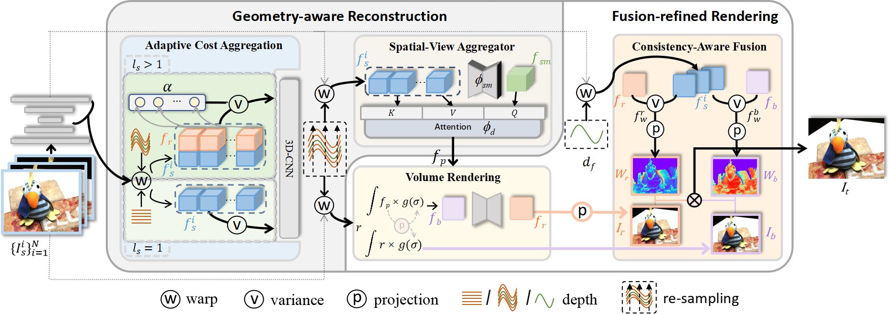

# Geometry-aware Reconstruction and Fusion-refined Rendering for Generalizable Neural Radiance Fields

PyTorch implementation of paper "Geometry-aware Reconstruction and Fusion-refined Rendering for Generalizable Neural Radiance Fields", CVPR 2024.

> [Geometry-aware Reconstruction and Fusion-refined Rendering for Generalizable Neural Radiance Fields](https://arxiv.org/abs/2404.17528)  
> Tianqi Liu, Xinyi Ye, Min Shi, Zihao Huang, Zhiyu Pan, Zhan Peng, Zhiguo Cao* \
> CVPR 2024  
> [project page](https://gefucvpr24.github.io/) | [paper](https://arxiv.org/abs/2404.17528) | [model](https://drive.google.com/drive/folders/1pCCOLUj2fNAbp0ZXj7_tEPfF1vZvMbh-?usp=drive_link) 


## Introduction
Generalizable NeRF aims to synthesize novel views for unseen scenes. Common practices involve constructing variance-based cost volumes for geometry reconstruction and encoding 3D descriptors for decoding novel views. However, existing methods show limited generalization ability in challenging conditions due to inaccurate geometry, sub-optimal descriptors, and decoding strategies. We address these issues point by point. First, we find the variance-based cost volume exhibits failure patterns as the features of pixels corresponding to the same point can be inconsistent across different views due to occlusions or reflections. We introduce an Adaptive Cost Aggregation (ACA) approach to amplify the contribution of consistent pixel pairs and suppress inconsistent ones. Unlike previous methods that solely fuse 2D features into descriptors, our approach introduces a Spatial-View Aggregator (SVA) to incorporate 3D context into descriptors through spatial and inter-view interaction. When decoding the descriptors, we observe the two existing decoding strategies excel in different areas, which are complementary. A Consistency-Aware Fusion (CAF) strategy is proposed to leverage the advantages of both. We incorporate the above ACA, SVA, and CAF into a coarse-to-fine framework, termed <i>Geometry-aware Reconstruction and Fusion-refined Rendering</i> (<b>GeFu</b>). GeFu attains state-of-the-art performance across multiple datasets.

<p align="center">

</p>

## Installation

### Clone this repository:

```
git clone https://github.com/TQTQliu/GeFu.git
cd GeFu
```

### Set up the python environment

```
conda create -n gefu python=3.8
conda activate gefu
pip install -r requirements.txt
pip install torch==1.9.0+cu111 torchvision==0.10.0+cu111 torchaudio==0.9.0 -f https://download.pytorch.org/whl/torch_stable.html 
```


## Datasets


#### 1. DTU

**Training data**. Download [DTU training data](https://drive.google.com/file/d/1eDjh-_bxKKnEuz5h-HXS7EDJn59clx6V/view) and [Depth raw](https://virutalbuy-public.oss-cn-hangzhou.aliyuncs.com/share/cascade-stereo/CasMVSNet/dtu_data/dtu_train_hr/Depths_raw.zip). Unzip and organize them as:
```
mvs_training
    ├── dtu                   
        ├── Cameras                
        ├── Depths   
        ├── Depths_raw
        └── Rectified
```

#### 2. NeRF Synthetic (Blender) and Real Forward-facing (LLFF)

Download the [NeRF Synthetic](https://drive.google.com/drive/folders/128yBriW1IG_3NJ5Rp7APSTZsJqdJdfc1) and [Real Forward-facing](https://drive.google.com/drive/folders/128yBriW1IG_3NJ5Rp7APSTZsJqdJdfc1) datasets and unzip them.


## Usage 
### Train generalizable model

To train a generalizable model from scratch on DTU, specify ``data_root`` in ``configs/gefu/dtu_pretrain.yaml`` first and then run:
```
python train_net.py --cfg_file configs/gefu/dtu_pretrain.yaml 
```

Our code also supports multi-gpu training. The released pretrained model was trained with 4 GPUs.
```
python -m torch.distributed.launch --nproc_per_node=4 train_net.py --cfg_file configs/gefu/dtu_pretrain.yaml distributed True gpus 0,1,2,3
```


### Per-scene optimization
Here we take the scan1 on the DTU as an example:
```
cd ./trained_model/gefu
mkdir dtu_ft_scan1
cp dtu_pretrain/latest.pth dtu_ft_scan1
cd ../..
python train_net.py --cfg_file configs/gefu/dtu/scan1.yaml
```

We provide the finetuned models for each scenes [here](https://drive.google.com/drive/folders/11X_YI4BmYoRG1Q8AYnOnvPQmqQufqSMo?usp=drive_link).


### Evaluation

#### Evaluate the pretrained model on DTU

Download the [pretrained model](https://drive.google.com/drive/folders/1pCCOLUj2fNAbp0ZXj7_tEPfF1vZvMbh-?usp=drive_link) and put it into `trained_model/gefu/dtu_pretrain/latest.pth`

Use the following command to evaluate the pretrained model on DTU:
```
python run.py --type evaluate --cfg_file configs/gefu/dtu_pretrain.yaml gefu.eval_depth True
```
The rendering images will be saved in ```result/gefu/dtu_pretrain```. Add the ```save_video True``` parameter at the end of the command to save the rendering videos.

#### Evaluate the pretrained model on Real Forward-facing

```
python run.py --type evaluate --cfg_file configs/gefu/llff_eval.yaml
```

#### Evaluate the pretrained model on NeRF Synthetic
```
python run.py --type evaluate --cfg_file configs/gefu/nerf_eval.yaml
```


## Citation
If you find our work useful for your research, please cite our paper.

```
@article{liu2024gefu,
    title={Geometry-aware Reconstruction and Fusion-refined Rendering for Generalizable Neural Radiance Fields},
    author={Liu, Tianqi and Ye, Xinyi and Shi, Min and Huang, Zihao and Pan, Zhiyu and Peng, Zhan and Cao, Zhiguo},
    journal={arXiv preprint arXiv:2404.17528},
    year={2024}
}
```

## Relevant Works

- [**PixelNeRF: Neural Radiance Fields from One or Few Images**](https://alexyu.net/pixelnerf/), CVPR 2021<br>

- [**IBRNet: Learning Multi-View Image-Based Rendering**](https://ibrnet.github.io/), CVPR 2021<br>

- [**MVSNeRF: Fast Generalizable Radiance Field Reconstruction from Multi-View Stereo**](https://apchenstu.github.io/mvsnerf/), ICCV 2021<br>

- [**Neural Rays for Occlusion-aware Image-based Rendering**](https://liuyuan-pal.github.io/NeuRay/), CVPR 2022<br>

- [**ENeRF: Efficient Neural Radiance Fields for Interactive Free-viewpoint Video**](https://zju3dv.github.io/enerf/), SIGGRAPH Asia 2022<br>

- [**Is Attention All NeRF Needs?**](https://vita-group.github.io/GNT/), ICLR 2023<br>

- [**Explicit Correspondence Matching for Generalizable Neural Radiance Fields**](https://donydchen.github.io/matchnerf/), arXiv 2023<br>


## Acknowledgement

The project is mainly based on [ENeRF](https://github.com/zju3dv/ENeRF?tab=readme-ov-file). Many thanks for their excellent contributions! When using our code, please also pay attention to the license of ENeRF.
